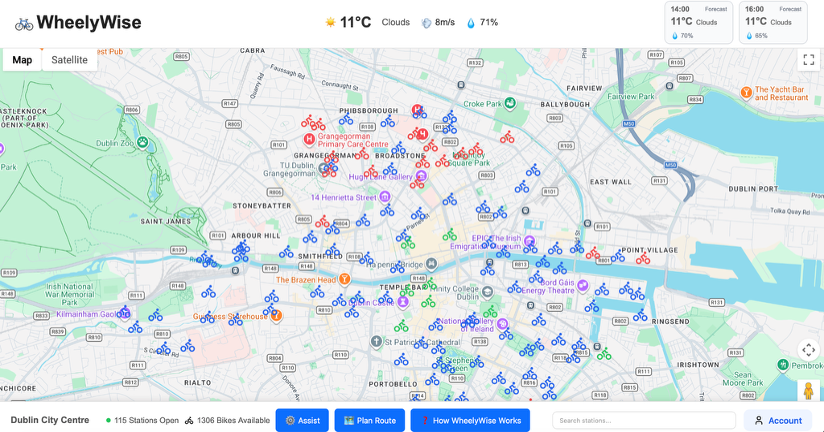

# WheelyWise — Dublin Bike Journey Companion

WheelyWise is a full-stack web application that helps Dublin commuters quickly decide whether a bike-share trip is practical right now. It brings live Dublin Bikes station availability, free-stand visibility, route planning, and weather conditions into a single map-based experience so users do not need to jump between multiple tools before starting a journey.



## Overview

A bike-share trip depends on more than just finding the nearest station. Users need to know whether there is a bike available near their starting point, whether there is a free stand near their destination, how to get there, and whether the current weather makes cycling a sensible choice.

WheelyWise combines those decisions into one simple interface powered by a Java Spring Boot backend and a browser-based map UI.

## Tech Stack

- **Backend:** Java 8, Spring Boot 2.7
- **Persistence:** MyBatis, MySQL 8
- **Frontend:** HTML, CSS, JavaScript
- **External APIs:** JCDecaux, OpenWeather, Google Maps Platform
- **Build Tool:** Maven

## Key Features

- **Live station availability**  
  View current Dublin Bikes station status, including available bikes and free stands.

- **Interactive map experience**  
  Explore station locations directly on a Google Map with visual station markers.

- **Route planning**  
  Plan a journey between two points and see how bike-share can fit into the route.

- **Station search**  
  Quickly find stations by name or location.

- **Weather-aware journey decisions**  
  Check current weather and short-term forecast while deciding whether to cycle.

- **Simple trip-assistance UI**  
  A user-friendly interface designed to support quick journey decisions in one place.

## Engineering Highlights

- **Java Spring Boot REST backend** serving both APIs and the browser frontend
- **MyBatis + MySQL persistence** for station and weather data
- **Scheduled data ingestion**
  - JCDecaux station data refreshed every 5 minutes
  - OpenWeather current weather and forecast refreshed every hour
- **Database-backed idempotent snapshot ingestion** using uniqueness constraints and upsert logic to prevent duplicate station snapshots
- **Failure-isolated external refresh jobs** so one provider failure does not interrupt other scheduled refreshes
- **Environment-based configuration** for database and API credentials

## Main API Endpoints

- `GET /api/bike/stations`
- `GET /api/bike/stations/{number}`
- `GET /api/bike/stations/{number}/history?limit=24`
- `GET /api/weather/current`
- `GET /api/weather/forecast`
- `GET /api/config`

## Run Locally

1. Initialize MySQL:

```bash
mysql -u root -p < init-database.sql
```

2. Configure the required database and API credentials using `.env.example`.

3. For Google Maps local development, allow:

```text
http://localhost:8080/*
```

4. Run the application:

```bash
mvn spring-boot:run
```

Then open:

```text
http://localhost:8080/
```